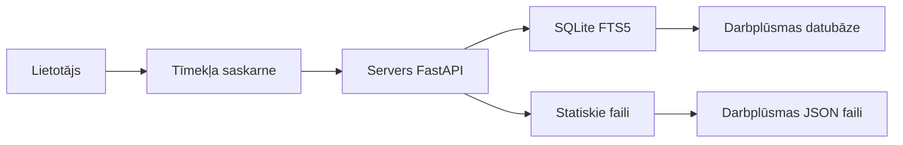

[repo]: https://github.com/mscbuild/workflows-n8n/
[demo]: https://mscbuild.github.io/workflows-n8n/

# n8n darbplūsmas kolekcija

<div align="center">


### Pilnīga n8n automatizācijas darbplūsmu kolekcija

**[Skatīt tiešsaistē](https://mscbuild.github.io/workflows-n8n/)** · **[Dokumentācija](#documentation)** · **[Ieguldījums projektā](#contributing)** · **[Licence](#license)**


</div>

---

## Kas jauns ?

### Jaunākie atjauninājumi (2026. gada aprīlis)
- **Uzlabota drošība**: Pilns drošības audits pabeigts, visi CVE novērsti
- **Docker atbalsts**: Vairāku platformu versijas Linux/amd64 un Linux/arm64
- **GitHub lapas**: Lietotāja saskarne ar reāllaika meklēšanu vietnē [workflows-n8n](https://mscbuild.github.io/workflows-n8n/)
- **Veiktspēja**: Meklēšana ir 100 reizes ātrāka, pateicoties SQLite FTS5 integrācijai
- **Moderns lietotāja interfeiss**: Pilnībā pārveidots lietotāja interfeiss ar tumšo/gaišo režīmu
---

## Ātra piekļuve

### Lietošana tiešsaistē (nav nepieciešama instalēšana)
Apmeklējiet **[n8n-workflows](https://mscbuild.github.io/workflows-n8n/)**, lai nekavējoties piekļūtu:
- **Viedā meklēšana** — darbplūsmu tūlītēja meklēšana
- **Vairāk nekā 15 kategorijas** — pārlūkošana pēc lietošanas gadījuma
- **Piemērots mobilajām ierīcēm** — darbojas jebkurā ierīcē
- **Tieša lejupielāde** — JSON darbplūsmu failu tūlītēja iegūšana
- **Adaptīvs tīmekļa dizains** — Adaptīvs tīmekļa dizains (RWD)

---

## Īpatnības

<table>
<tr>
<td width="50%">

### Skaitļos
- 4343 lietošanai gatavas darbplūsmas
- 365 unikālas integrācijas
- 29 445 mezgli kopā
- 15 sakārtotas kategorijas
- 100% veiksmīga importēšana

</td>
<td width="50%">

### Veiktspēja
- **< 100 ms** meklēšanas atbildes laiks
- **< 50 MB** atmiņas izmantošana
- **700x** mazāka nekā 1. versija
- **10x** ātrāka ielāde
- **40x** mazāka RAM izmantošana

</td>
</tr>
</table>

---

## Lokālā instalēšana

### Priekšnosacījumi
- Python 3.9+
- pip (Python pakotņu pārvaldnieks)
- 100 MB brīvas vietas diskā

### Ātrā sākšana
```bash
# Repozitorija klonēšana
git clone https://github.com/mscbuild/workflows-n8n.git
cd workflows-n8n

# Atkarību instalēšana
pip install -r requirements.txt

# Servera palaišana
python run.py

# Atvērt pārlūkprogrammā
# http://localhost:8000
```

### Docker instalēšana
```bash
# Docker Hub izmantošana
docker run -p 8000:8000 mscbuild/workflows-n8n:latest

# Vai lokāla būvēšana
docker build -t workflows-n8n .

docker run -p 8000:8000 workflows-n8n
```

---

## Dokumentācija

### API saskarnes

| Beigu punkts   | Metode| Apraksts |
|----------------|-------|----------|
| `/` | GET | Tīmekļa saskarne |
| `/api/search` | GET | Meklēt darbplūsmas |
| `/api/stats` | GET | Repozitorija statistika |
| `/api/workflow/{id}` | GET | JSON datu izgūšana no darbplūsmām |
| `/api/categories` | GET | Visu kategoriju saraksts |
| `/api/export` | GET | Darbplūsmu eksportēšana |

### Meklēšanas funkcijas
- **Pilna teksta meklēšana** pēc nosaukumiem, aprakstiem un mezgliem
- **Filtrēšana pēc kategorijas** (mārketings, pārdošana, DevOps utt.)
- **Filtrēšana pēc sarežģītības** (zema, vidēja, augsta)
- **Filtrēšana pēc aktivizētāja veida** (tīmekļa aizķere, grafiks, manuāla utt.)
- **Filtrēšana pēc pakalpojuma** (vairāk nekā 365 integrācijas)

---

## Arhitektūra



### Tehnoloģiju komplekts
- **Aizmugurējā daļa**: Python, FastAPI, SQLite ar FTS5
- **Frontend**: Vanilla JS, Tailwind CSS
- **Datubāze**: SQLite ar pilna teksta meklēšanu
- **Izvietošana**: Docker, GitHub Actions, GitHub Pages
- **Drošība**: Trivy skenēšana, CORS aizsardzība, ievades validācija

---

## Repozitorija struktūra

```
n8n-workflows/
├── workflows/ # 4343 Darbplūsmu JSON fails
│ └── [category]/ # Organizēts pēc integrācijas
├── docs/ # GitHub Pages tīmekļa vietne
├── src/ # Python avota kods
├── scripts/ # Palīgskripti
├── helm/   # Kubernetes pārvaldības shēma
├── k8s/    # Kubernetes neapstrādātie manifesti  
├── api_server.py # FastAPI lietojumprogramma
├── run.py # Servera palaišana
├── workflow_db.py # Datu bāzes pārvaldnieks
└── requirements.txt # Python atkarības
```

---
 

## Ieguldījumi

Mēs labprāt uzklausīsim jūsu ieguldījumus! Lūk, kā jūs varat palīdzēt:

### Ieguldījuma metodes
- **Ziņot par kļūdām** sadaļā [Problēmas](https://github.com/mscbuild/workflows-n8n/issues)
**Ieteikt jaunas funkcijas** sadaļā [Diskusijas](https://github.com/mscbuild/workflows-n8n/discussions)
- **Uzlabot dokumentāciju**
- **Iesniegt darbplūsmas labojumus**
- **Atzīmēt repozitoriju ar zvaigznīti**

## Svarīgas piezīmes

**Drošība un privātums**

- Pirmslietošanas verifikācija - Visas darbplūsmas tiek nodrošinātas “tādā stāvoklī”, kādā tās ir, izglītības nolūkos
- Akreditācijas datu atjaunināšana - API atslēgu, žetonu un tīmekļa āķu aizstāšana
- Droša testēšana - Pirmslietošanas verifikācija izstrādes vidē
- Atļauju pārbaude - Pareizas piekļuves nodrošināšana integrācijām

## Licence

Šis projekts ir licencēts saskaņā ar MIT licenci - sīkāku informāciju skatiet failā [LICENCE](LICENCE).

---

## Atbalsts

Ja šis projekts jums bija noderīgs, lūdzu, apsveriet:
<div align="center">

[](https://github.com/mscbuild/n8n-workflows)

</div>

---
<!--
keywords: n8n workflows, n8n automation, n8n examples, n8n templates, no-code automation, telegram bot workflows, openai n8n, webhook automation
-->
 
