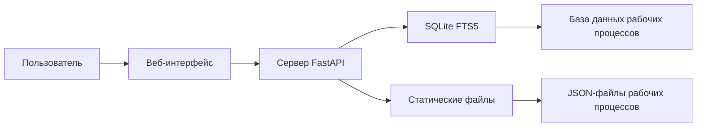

# Коллекция рабочих процессов n8n

<div align="center">


### Полная коллекция рабочих процессов автоматизации n8n

**[Просмотреть Онлайн](https://mscbuild.github.io/n8n-workflows/)** · **[Документация](#documentation)** · **[Вклад в проект](#contributing)** · **[Лицензия](#license)**


</div>

---

## Что нового

### Последние обновления (апрель 2026 г.)
- **Повышенная безопасность**: Полный аудит безопасности завершен, все CVE устранены
- **Поддержка Docker**: Многоплатформенные сборки для linux/amd64 и linux/arm64
- **GitHub Pages**: Интерфейс с возможностью поиска в реальном времени на [n8n-workflows](https://mscbuild.github.io/n8n-workflows/)
- **Производительность**: Поиск в 100 раз быстрее благодаря интеграции с SQLite FTS5
- **Современный пользовательский интерфейс**: Полностью переработанный интерфейс с темным/светлым режимом

---

## Быстрый доступ

### Использование онлайн (без установки)
Посетите **[n8n-workflows](https://mscbuild.github.io/n8n-workflows/)** для мгновенного доступа к:
- **Умный поиск** — Мгновенный поиск рабочих процессов
- **Более 15 категорий** — Просмотр по вариантам использования
- **Готовность к мобильным устройствам** — Работает на любом устройстве
- **Прямая загрузка** — Мгновенное получение JSON-файлов рабочих процессов

---

## Особенности

<table>
<tr>
<td width="50%">

### В цифрах
- **4343** готовых к использованию рабочих процессов
- **365** уникальных интеграций
- **29445** всего узлов
- **15** организованных категорий
- **100%** успешный импорт

</td>
<td width="50%">

### Производительность
- **< 100 мс** время отклика поиска
- **< 50 МБ** использования памяти
- **в 700 раз** меньше, чем версия 1
- **в 10 раз** более быстрая загрузка
- **в 40 раз** меньше использования оперативной памяти

</td>
</tr>
</table>

---

## Локальная установка

### Необходимые условия
- Python 3.9+
- pip (менеджер пакетов Python)
- 100 МБ свободного места на диске пространство

### Быстрый старт
```bash
# Клонирование репозитория
git clone https://github.com/mscbuild/n8n-workflows.git
cd n8n-workflows

# Установка зависимостей
pip install -r requirements.txt

# Запуск сервера
python run.py

# Открыть в браузере
# http://localhost:8000
```

### Установка Docker
```bash
# Использование Docker Hub
docker run -p 8000:8000 mscbuild/n8n-workflows:latest

# Или локальная сборка
docker build -t n8n-workflows .

docker run -p 8000:8000 n8n-workflows
```

---

## Документация

### API-интерфейсы

| Конечная точка | Метод | Описание |
|----------------|-------|----------|
| `/` | GET | Веб-интерфейс |
| `/api/search` | GET | Поиск рабочих процессов |
| `/api/stats` | GET | Статистика репозитория |
| `/api/workflow/{id}` | GET | Получение JSON-данных рабочих процессов |
| `/api/categories` | GET | Список всех категорий |
| `/api/export` | GET | Экспорт рабочих процессов |

### Функции поиска
- **Полнотекстовый поиск** по именам, описаниям и узлам
- **Фильтрация по категориям** (Маркетинг, Продажи, DevOps и т. д.)
- **Фильтрация по сложности** (Низкая, Средняя, ​​Высокая)
- **Фильтрация по типу триггера** (Веб-хук, Расписание, Ручной и т. д.)
- **Фильтрация по сервисам** (более 365 интеграций)

---

## Архитектура



### Технологический стек
- **Бэкенд**: Python, FastAPI, SQLite с FTS5
- **Фронтенд**: Vanilla JS, Tailwind CSS
- **База данных**: SQLite с полнотекстовым поиском
- **Развертывание**: Docker, GitHub Actions, GitHub Pages
- **Безопасность**: сканирование Trivy, защита CORS, проверка входных данных

---

## Структура репозитория

```
n8n-workflows/
├── workflows/ # 4343 JSON-файла рабочих процессов
│ └── [category]/ # Организовано по интеграции
├── docs/ # Сайт GitHub Pages
├── src/ # Исходный код Python
├── scripts/ # Вспомогательные скрипты
├── api_server.py # Приложение FastAPI
├── run.py # Сервер Запуск
├── workflow_db.py # Менеджер баз данных
└── requirements.txt # Зависимости Python
```

---
 

## Вклад

Мы приветствуем вклад! Вот как вы можете помочь:

### Способы внесения вклада
- **Сообщайте об ошибках** через [Issues](https://github.com/Zie619/n8n-workflows/issues)
**Предложите новые функции** в [Обсуждениях](https://github.com/Zie619/n8n-workflows/discussions)
- **Улучшите документацию**
- **Отправьте исправления для рабочих процессов**
- **Поставьте звездочку репозиторию**

## Важные примечания

**Безопасность и конфиденциальность**

- Проверка перед использованием - Все рабочие процессы предоставляются как есть в образовательных целях
- Обновление учетных данных - Замена ключей API, токенов и веб-хуков
- Безопасное тестирование - Предварительная проверка в среде разработки
- Проверка разрешений - Обеспечение надлежащих прав доступа для интеграций

## Лицензия

Этот проект распространяется под лицензией MIT - подробности см. в файле [LICENSE](LICENSE).

---

## Поддержка

Если этот проект оказался вам полезен, пожалуйста, рассмотрите:
<div align="center">

[](https://github.com/mscbuild/n8n-workflows)

</div>

---
<!--
keywords: n8n workflows, n8n automation, n8n examples, n8n templates, no-code automation, telegram bot workflows, openai n8n, webhook automation
-->
 
