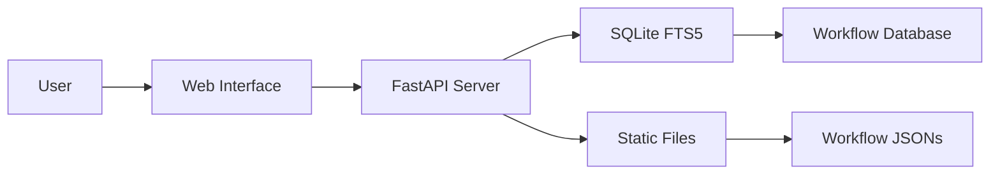

[repo]: https://github.com/mscbuild/workflows-n8n/
[demo]: https://mscbuild.github.io/workflows-n8n/

<div align="center">
 
# Best Workflow Automation Templates.
 
</div>
 

<div align="center">

  
  
 
 


 

### The Ultimate Collection of n8n Automation Workflows

**[Browse Online](https://mscbuild.github.io/workflows-n8n/)** · **[Documentation](#documentation)** · **[Contributing](#contributing)** · **[License](#license)**


</div>

---

## What's New

### Latest Updates (April 2026)
- **Enhanced Security**: Full security audit completed, all CVEs resolved
- **Docker Support**: Multi-platform builds for linux/amd64 and linux/arm64
- **GitHub Pages**: Live searchable interface at [workflows-m8n](https://mscbuild.github.io/workflows-n8n/)
- **Performance**: 100x faster search with SQLite FTS5 integration
- **Modern UI**: Completely redesigned interface with dark/light mode

---

## Quick Access

### Use Online (No Installation)
Visit **[workflows-n8n](https://mscbuild.github.io/workflows-n8n/)** for instant access to:
- **Smart Search** — Find workflows instantly
- **15+ Categories** — Browse by use case
- **Mobile Ready** — Works on any device
- **Direct Downloads** — Get workflow JSONs instantly

---

## Features

<table>
<tr>
<td width="50%">

### By The Numbers
- **4,343** Production-Ready Workflows
- **365** Unique Integrations
- **29,445** Total Nodes
- **15** Organized Categories
- **100%** Import Success Rate

</td>
<td width="50%">

### Performance
- **< 100ms** Search Response
- **< 50MB** Memory Usage
- **700x** Smaller Than v1
- **10x** Faster Load Times
- **40x** Less RAM Usage

</td>
</tr>
</table>

---

## Local Installation

### Prerequisites
- Python 3.9+
- pip (Python package manager)
- 100MB free disk space

### Quick Start
```bash
# Clone the repository
git clone https://github.com/mscbuild/workflows-n8n.git
cd workflows-n8n

# Install dependencies
pip install -r requirements.txt

# Start the server
python run.py
 
# Open in browser
# http://localhost:8000
```

### Docker Installation
```bash
# Using Docker Hub
docker run -p 8000:8000 mscbuild/workflows-n8n:latest

# Or build locally
docker build -t n8n-workflows .
docker run -p 8000:8000 workflows-n8n
```

---

## Documentation

### API Endpoints

| Endpoint | Method | Description |
|----------|--------|-------------|
| `/` | GET | Web interface |
| `/api/search` | GET | Search workflows |
| `/api/stats` | GET | Repository statistics |
| `/api/workflow/{id}` | GET | Get workflow JSON |
| `/api/categories` | GET | List all categories |
| `/api/export` | GET | Export workflows |

### Search Features
- **Full-text search** across names, descriptions, and nodes
- **Category filtering** (Marketing, Sales, DevOps, etc.)
- **Complexity filtering** (Low, Medium, High)
- **Trigger type filtering** (Webhook, Schedule, Manual, etc.)
- **Service filtering** (365+ integrations)

---

## Architecture



### Tech Stack
- **Backend**: Python, FastAPI, SQLite with FTS5
- **Frontend**: Vanilla JS, Tailwind CSS
- **Database**: SQLite with Full-Text Search
- **Deployment**: Docker, GitHub Actions, GitHub Pages
- **Security**: Trivy scanning, CORS protection, Input validation

---

## Repository Structure

```
n8n-workflows/
├── workflows/           # 4,343 workflow JSON files
│   └── [category]/     # Organized by integration
├── docs/               # GitHub Pages site
├── src/                # Python source code
├── scripts/            # Utility scripts
├── api_server.py       # FastAPI application
├── run.py              # Server launcher
├── workflow_db.py      # Database manager
└── requirements.txt    # Python dependencies
```

---
 

## Contributing

We love contributions! Here's how you can help:

### Ways to Contribute
- **Report bugs** via [Issues](https://github.com/mscbuild/workflows-n8n/issues)
- **Suggest features** in [Discussions](https://github.com/mscbuild/workflows-n8n/discussions)
- **Improve documentation**
- **Submit workflow fixes**
- **Star the repository**

### Development Setup
```bash
# Fork and clone
git clone https://github.com/YOUR_USERNAME/workflows-n8n.git

# Create branch
git checkout -b feature/amazing-feature

# Make changes and test
python run.py --debug

# Commit and push
git add .
git commit -m "feat: add amazing feature"
git push origin feature/amazing-feature

# Open PR
```

---

## Security

### Security Features
- Path traversal protection
- Input validation & sanitization
- CORS protection
- Rate limiting
- Docker security hardening
- Non-root container user
- Regular security scanning

### Reporting Security Issues
Please report security vulnerabilities to the maintainers via [Security Advisory](https://github.com/Zie619/n8n-workflows/security/advisories/new).

---

## Important Notes

**Security & Privacy**

- Review before use - All workflows shared as-is for educational purposes
- Update credentials - Replace API keys, tokens, and webhooks
- Test safely - Verify in development environment first
- Check permissions - Ensure proper access rights for integrations

## License

This project is licensed under the MIT License - see the [LICENSE](LICENSE) file for details.

Huginn was originally created by  [Zie619](https://github.com/Zie619/n8n-workflows). Since then, many people's dedicated contributions have made it what it is today
---
 
## Support

If you find this project helpful, please consider:

<div align="center">

[](https://github.com/mscbuild/n8n-workflows)

</div>

<div align="center">
[](https://github.com/mscbuild/workflow-n8n/actions/workflows/ci-cd.yml)
[](https://github.com/mscbuild/workflow-n8n/actions/workflows/pages-deploy.yml)
[](https://github.com/mscbuild/workflow-n8n/actions/workflows/docker.yml)

 </div>
---
<!--
keywords: n8n workflows, n8n automation, n8n examples, n8n templates, no-code automation, telegram bot workflows, openai n8n, webhook automation
-->
 
